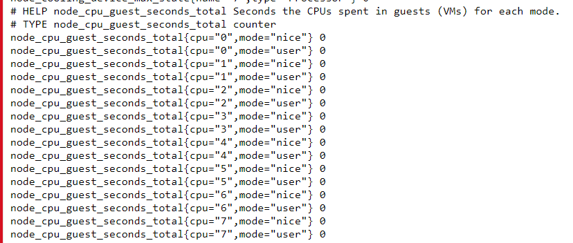
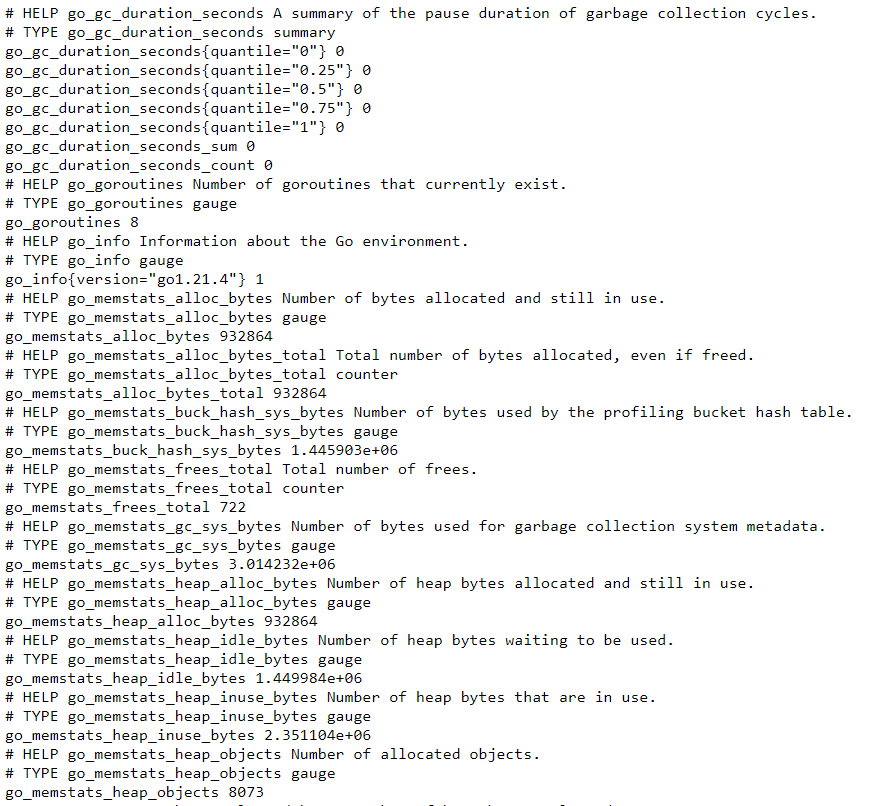

## DATA MODELS - exam cocepts

The first thing to know, prometheus saves ALL data in TIME SERIES. These TIME SERIES can be defined as: 
    - streams of timestamped values belonging to the same metric and the same set of labeled dimensions. 
    - Besides stored time series,
    - Prometheus may generate temporary derived time series as the result of queries.

**Metric names and labels**

Each time series is identified uniquely by its metric name and optional key-value pairs called labels.

- Specify the general feature of a system that is measured (e.g. http_requests_total - the total number of HTTP requests received).
- Metric names may contain ASCII letters, digits, underscores, and colons. It must match the regex [a-zA-Z_:][a-zA-Z0-9_:]*.

**Samples** 

Samples form the actual time series data. Each sample consists of:

- a float64 value
- a millisecond-precision timestamp

**Notation**

Given a metric name and a set of labels, time series are frequently identified using this notation:

## Exam Questions
- Which of the following statements are true about the data model in Prometheus?
    -  It consists of metrics, labels, and timestamps
    -  Metrics are numeric values representing measurements
    -  Labels are key-value pairs that allow for dimensional data

The Prometheus data model consists of three parts: metrics, labels, and timestamps. 
Metrics are the numeric values representing the measurements. 
Labels are key-value pairs that allow for dimensional data. 
Timestamps are not required for all metrics, but are included in the data model.

- Which of the following statements are true about metric types in Prometheus?
    - Counter metrics represent a monotonically increasing value
    - Gauge metrics represent a value that can go up or down
    - Histogram metrics represent the distribution of values over a range
    - Summary metrics represent a set of quantiles over a sliding time window

Prometheus has four metric types: counter, gauge, histogram, and summary. Counter metrics represent a monotonically increasing value. Gauge metrics represent a value that can go up or down. Histogram metrics represent the distribution of values over a range. Summary metrics represent a set of quantiles over a sliding time window.

- What is the purpose of a relabeling configuration in Prometheus? (Select all that apply)
    - To transform metric labels.
    - To apply a consistent set of labels to all metrics scraped from a target.

A relabeling configuration in Prometheus is used to transform metric labels, or to apply a consistent set of labels to all metrics scraped from a target. This can be useful for standardizing or normalizing metrics across multiple targets.

- Which of the following statements are true about labels in Prometheus?

    - Labels can be changed dynamically during runtime
    - Labels are used to identify different instances of the same metric
    - Labels can be used for grouping and aggregation

Labels are key-value pairs that allow for dimensional data. They can be changed dynamically during runtime and are used to identify different instances of the same 
metric. Labels can also be used for grouping and aggregation. They are not required for all metrics, but are included in the data model.

- Which of the following statements are true about metric aggregation in Prometheus?

    - Aggregation can be performed across multiple labels
    -  Aggregation can be performed using functions such as sum, avg, and max

Aggregation can be performed across multiple labels using functions such as sum, avg, and max. Aggregation cannot be performed across different metric types and cannot be performed dynamically during runtime.

- Which of the following statements are true about metric names in Prometheus?

    - Metric names must be unique
    - Metric names should be descriptive and human-readable
    - Metric names cannot contain spaces or special characters

Metric names must be unique, should be descriptive and human-readable, and cannot contain spaces or special characters. Metric names cannot be changed dynamically during runtime and must be set at configuration time.

