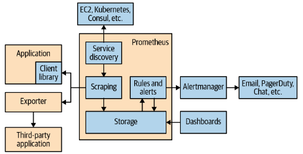
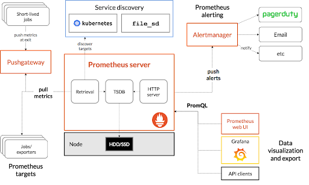

## Prometheus Architecture

The next images show the prometheus architecture. As we can see, the first image is the architecture uses for the Julien Pivotto's book and the secon figure is the official used for prometheus. 

**architecture_1**

shows the overall architecture of Prometheus. Prometheus discovers targets to scrape from service discovery. These can be your own instrumented applications or third-party applications you can scrape via an exporter. The scraped data is stored, and you can use it in dashboards using PromQL or send alerts to the Alertmanager, which will convert them into pages, emails, and other notifications.

**architecture_2**:

 The server is the brain of any web or mobile  application. Prometheus server does the same for Prometheus services or clusters. It collects multi-dimensional data in time series and then analyzes and aggregates the collected data. The process of collecting metrics is called scraping. 
 

### Prometheus architecture elements

- **Client libraries** : 
    
    As we all know, Prometheus collects data in time-series formats that are multi-dimensional. So clients are always asked to send in this form specifically. But in most cases, metrics rules are not automatically written; instead, you need to add them manually. So for making metrics in Prometheus-compatible formats, there are two ways. It can be done manually on the client-side or use third-party exporters to convert data in Prometheus formats. When you control the client’s source code, you can go ahead with the first option; otherwise, second.

    Prometheus provides various client libraries, some are official, and some are unofficial. If you can control the source code, client libraries provide the client-specific instrumentation and metrics collection. The client library sends the current state of all tracked metrics to the server whenever Prometheus scrapes your instances’ HTTP endpoint.

    Client libraries for instrumenting your own code are available in Go, Java/JVM, C#/.Net, Python, Ruby, Node.js, Haskell, Erlang, and Rust, among other prominent languages and runtimes. Software like Kubernetes and Docker already include Prometheus client libraries. There are hundreds of integrations available for third-party software that offers metrics in a non-Prometheus format. HAProxy, MySQL, PostgreSQL, Redis, JMX, SNMP, Consul, and Kafka are examples of exporters.

    **Official client libraries:**

   - Go
   - Java or Scala
   - Python
   - Ruby
   - .Net

- **Exporters**

    An exporter is a piece of software that you deploy right beside the application you want to obtain metrics from. It takes in requests from Prometheus, gathers the required data from the application, transforms it into the correct format, and finally returns it in a response to Prometheus. You can think of an exporter as a small one-to-one proxy, converting data between the metrics interface of an application and the Prometheus exposition format.

    As mentioned above, in most cases, metrics are self-exposed by the service. In such cases, **Prometheus automatically collects metrics.** In other cases, Prometheus needs to scrape metrics. Exporters are **third-party tools that help scrape metrics when it is not feasible to extract metrics directly**. Some exporters are official, while others are not officially declared in the Prometheus Github organization.

- **Service Discovery** 

    Once you have all your applications instrumented and your exporters running, Prometheus needs to know where they are. This is so Prometheus will know what to monitor, and be able to notice if something it is meant to be monitoring is not responding. With dynamic environments you cannot simply provide a list of applications and  exporters once, as it will get out of date. This is where service discovery comes in.

    This is where service discovery comes into play. Service discovery helps in providing Prometheus the information of what to escape in whichever database you want. Prometheus’ common service discovery resources are Consul, Amazon’s EC2, and Kubernetes out of the box. 

    For non-supported source resources, you have to use a file-based service discovery mechanism. This can be done using your configuration management system like Ansible or Chef and pass the script containing a list of sources from which you want to pull data.

- **Scrapping** 

    Service discovery and relabeling give us a list of targets to be monitored. Now Prometheus needs to fetch the metrics. Prometheus does this by sending an HTTP request called a scrape. The response to the scrape is parsed and ingested into storage. Several useful metrics are also added in, such as if the scrape succeeded and how long it took. Scrapes happen regularly; usually you would configure it to happen every 10 to 60 seconds for each target.

- **AlertManager**

    Alertmanager is responsible for managing the alerts sent by the clients. It checks for supplication, groups the signals, and routes them to the correct application like email, Pagerduty, Opsgenie, etc. It also checks for when it should keep alerts off and when not. 

    You can do various things with Alerts received from a client (Prometheus Server) to the Alertmanager. You can group similar types of notifications that prevent you from seeing similar notifications repetitively. You can mute notifications as well. 

    When a network partition occurs, there are hundreds of instances running. More than half of the instances could not reach the database, and there are alerting rules so that it sends an alert to the alert manager for every instance that did not reach the database. In the alert manager, you can configure that all alerts related to the same type of instance are compiled in a single alert and then sent to the alert manager. 
    
    *Grouping*

    You may have noticed that notifications from the same app often come as a single notification on your smartphone. This is called grouping. Grouping clubs the notifications of a single nature into a single notification. 

    In the Prometheus server,  hundreds of notifications come at once, and it may make the system fall as it has to fire hundreds of alerts simultaneously. Grouping converts a similar type of notification into a single one and thus reduces the server load. A routing tree in the configuration file controls the setting for grouping and their timing.

    *Inhibition*

    Inhibition is generally suppressing one notification when the other alerts are already firing. For example, an alert is firing, which notifies that the cluster is not reachable. Alertmanger then could pause all the alerts related to this cluster and prevent firing hundreds of alerts unrelated to the issue. The configuration file controls the properties of inhibition.

    *Silence*

    Silence is the property that mutes the alerts for a particular time. Silence occurs with the help of matches, like regex matching. The incoming alerts matched with the regular expression and properties of the previous alerts; if they do, then no notification will be sent to the system. Silence configures in the web interface of the Alertmanger.

    *Configuring Alert Manager*

    For configuring Alertmanager to Prometheus, you have to tell Prometheus how to communicate with the Alertmanager.  For this, you have to add the following lines to the prometheus.yml file.

- **PushGateway**

    The Prometheus server alone would not scrape all kinds of metrics; some require extra mechanics. Prometheus Gateway is the intermediary source used for metrics from those jobs which can not be scraped by usual methods. There are certain drawbacks to using Prometheus Gateway blindly:

    When you are opening multiple instances through a Prometheus Gateway, It creates a point of failure and can be a bottleneck.
    You could not use Prometheus automatic instance health monitoring.
    The push gateway always exposes the data collected to the Prometheus for any reason,  and we can not delete that information manually from the Gateway’s API.

    When multiple instances of a job use an instance label for differentiating their metrics in the push gateway, the metrics remain in the push gateway even after the original entity deletes. It happens because the lifecycle of an instance in the push gateway is different from the lifecycle of the actual process. On the other hand, in Prometheus classical pull, metrics also delete when the original instance gets deleted.

    One case where push gateway is handy is when you want to capture service-level batch jobs. A service-level batch job is not semantically related to a particular job or machine, for example, deleting the number from the entire system. This kind of metrics should not include machine or instance labels that decouple the lifecycle of specific machines or instances from the pushed metrics.

- **Why NOT PROMETHEUS**

    **As a metrics-based system, Prometheus is not suitable for storing event logs or
    individual events. Nor is it the best choice for    high-cardinality data, such as email
    addresses or usernames.**

    **Prometheus is designed for operational monitoring, where small inaccuracies and
    race conditions due to factors like kernel scheduling and failed scrapes are a fact of
    life. Prometheus makes trade-offs and prefers giving you data that is 99.9% correct
    over your monitoring breaking while waiting for perfect data. Thus in applications
    involving money or billing, Prometheus should be used with  caution.**

    Now that you know where Prometheus fits into the larger monitoring landscape and its principal components, let's look at some cases for which Prometheus isn't an excellent decision.

    You cannot use Prometheus as a metric system to store event logs or events. You can’t choose even high cardinal data such as email addresses or usernames. Prometheus is for operational monitoring where minor inaccuracies and race conditions are a part of life because of kernel planning and failed scrapings. Prometheus compromises and prefers to give you data that is 99.9% correct when waiting for accurate information. You should therefore use Prometheus with caution in applications involving money or billing.

    When Prometheus is scaled up, it encounters difficulties (a situation that is often unavoidable in the era of highly distributed modern systems). Prometheus can’t query and aggregate metrics from numerous instances from the start. If Prometheus engineers try to solve this problem, it would require a lot of engineering effort and add complexity in Prometheus deployment. This can disrupt the overall importance of Prometheus as a management tool, which is essential for executing incident response at any degree of efficiency.

    Finally, Prometheus cannot save metrics data for a long time. This type of historical data can be quite useful for firms that manage complicated ecosystems. For example, organizations may wish to examine these metrics to see if any patterns emerge over the course of a few months or even a year, in order to acquire a better knowledge of system utilization over time. When systems are pushed to their limitations, such insights can help choose scaling solutions.

    The above cons of Prometheus happen only when Prometheus is used standalone, but when you pair Prometheus with some other tools like Grafana, SumoLogic etc, it can provide all those features you’re missing.